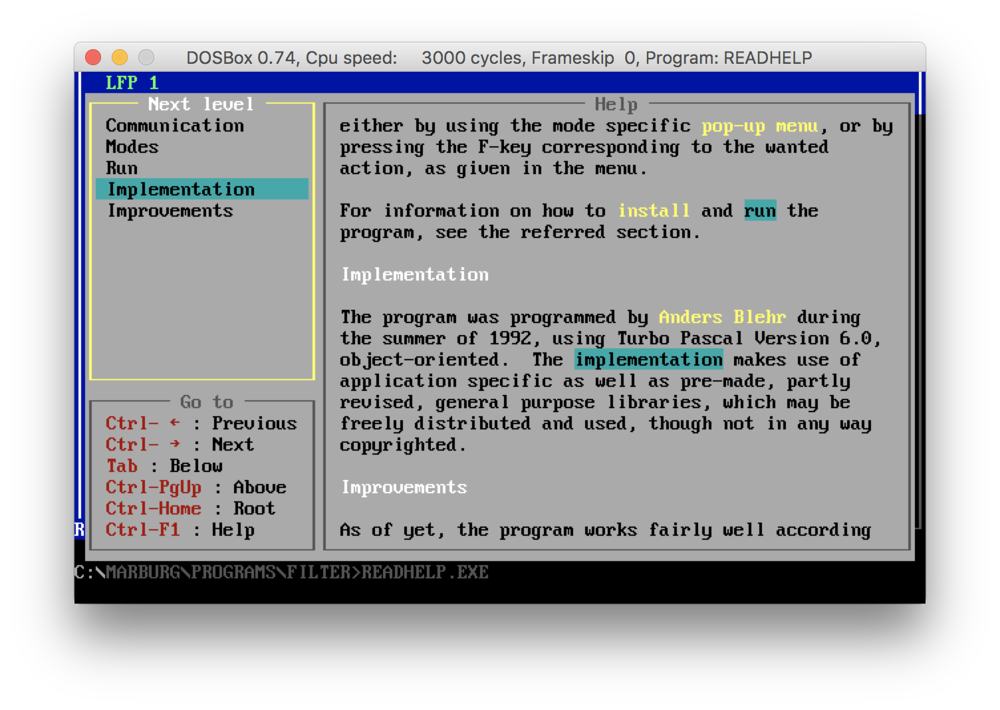
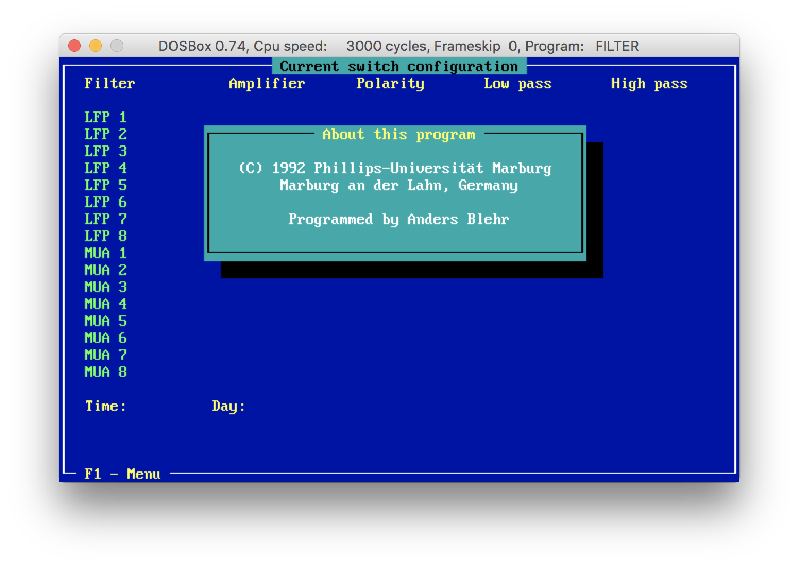

# Scrapbook

Over the decades that I have been writing code, some pieces have stuck with me more than others, and I have copied them onto floppies, FTP'ed them down, pulled them over from computer to computer, and kept them more or less at hand to reminisce over whenever nostalgia should hit. In reverse chronological order they are:

## <a name="jsoncache">[JSONCache](https://github.com/andersblehr/JSONCache) (2017)

My first open source project. I was on a project working on an iOS app that required local caching of backend data, and after having hit a brick wall with [3lvis](https://github.com/3lvis)'s eminent [Sync](https://github.com/3lvis/Sync) library (due to [this bug](https://github.com/3lvis/Sync/issues/373)), I decided to roll my own. I had already implemented a data caching and replication framework for [Origon](https://github.com/andersblehr/Origon), so I knew it wouldn't be too hard. I plugged it into the app (which is under NDA, so I can't give details), and it has been working flawlessly ever since.

**Language:** Swift 
**Platforms:** macOS, iOS, watchOS, tvOS

## <a name="origon">[Origon - shared contact lists](https://github.com/andersblehr/Origon) (2015)

This was the app idea that I 'bet the house on' when I quit my day job in 2012. From Origon's [web page](https://origon.co):

> _With Origon's shared contact lists, everybody keeps their own contact information up to date. Whenever one of your contacts updates their address, email or phone number, you will have their updated information at your fingertips the next time you open Origon. This way, the contact lists always stay up to date._

To enable users to mirror each other's contact information, the app (iOS only for the foreseeable future) accesses a set of REST endpoints exposed by the **[Origon backend](https://github.com/andersblehr/OrigonBackend)**. Together, the app and the backend constitute a replication framework that seemlessly persists changes from indvidual users and pushes those same changes back out to linked users. The backend is hosted on [Google App Engine](https://cloud.google.com/appengine/) (GAE) and utilises [RESTEasy](http://resteasy.jboss.org) for the API and [Objectify](https://github.com/objectify/objectify) for interfacing with the GAE datastore.

Origon is still available in the iOS App Store (for free since 2017). However, it took too long too make, was marketed too haphazardly (marketing most definitely is _not_ my strong suite), and the income turned out not to be sufficient to make a living. Then [Spond](https://spond.com/) launched with essentially the same idea, and I realised Origon offered too little, if not too late.

Still, it was an invaluable learning experience, both technology wise and personally. (And I still have my house.)

**Languages:** Objective-C (app), Java (backend) 
**Platforms:** iOS (app), Google App Engine (backend)

## <a name="smp">[Sheet music player](https://github.com/andersblehr/SheetMusicPlayer) (2011)

With kids, you may happen upon a song, notes and all, when you read them their good night story. Or they may come home from daycare or school with a song sheet and want you to help them learn the song. Even though I play the piano and know how to read music, I am not able to sing directly from notes on a sheet, and I found myself wanting an app with which I could snap a photo of the music sheet and have it play the melody back to me. No such app existed, and I took it upon myself to create one. I had never done any mobile development, but I had an iPhone and a Mac, so I installed Xcode, dug out the same Digital Image Processing book I referenced in my **[thesis](https://github.com/andersblehr/Scrapbook/blob/1993/Uni/Thesis/EyeTracker/TeX/diplom.pdf)** back in 1993, and got going.

I got to a certain point when I realised that the hurdle I was struggling with was an artifact of my entire approach, and that I would have to start (almost) over to get past it. I still haven't started over, but if it hadn't been for this project, I might be still be shuffling papers around for a living, rather than write code.

**Language:** Objective-C 
**Platform:** iOS (iPhone)

## <a name="maven-esp-plugin">[FAST Maven plugin](https://github.com/andersblehr/Scrapbook/tree/2007/Work/FastMavenPlugin)[*](#abandonware) (2007)

I was heading up FAST's Solution Architecture Centre in Europe, aiming to streamline how we delivered projects to customers. Each _Enterprise Search Platform_ (ESP) installation was different, but the underpinnings were the same. Still, installation and configuration had to be done manually by on-site or remote FAST engineers. I had a hunch that [Apache Maven](https://maven.apache.org) might help to automate a lot of the manual work, and itching to code again, I took it upon myself to develop an ESP plugin prototype for Maven.

**Language:** Java 
**Platforms:** Linux, Windows

## <a name="fast">FAST search components[*](#abandonware) (2000-2001)

Working as a developer in FAST's R&D department, I was tasked with developing a generic **[tokenizer](https://github.com/andersblehr/Scrapbook/tree/2001/Work/FastTokenizer)** that would decompose raw data into indexable words across a wide range of languages (including Chinese and other East Asian languages). Another component I developed, was a **[SAX wrapper](https://github.com/andersblehr/Scrapbook/tree/2001/Work/FastSAXWrapper)** that abstracted away the implementation details of [libxml](http://xmlsoft.org) and other third party [SAX](https://en.wikipedia.org/wiki/Simple_API_for_XML) interfaces, effectively letting us inject whichever SAX library suited us best. Lastly, based on my experience with having to [convert to FiXML](https://github.com/andersblehr/Scrapbook/tree/2000/Work/FastIndexingPreprocessor) any raw data other than HTML, I developed a generic **[XML indexer](https://github.com/andersblehr/Scrapbook/tree/2001/Work/FastXMLIndexer)** that could index any set of well-formed XML documents.

**Language:** C++ 
**Platforms:** Linux, Solaris

## <a name="fixmlconvert">[FAST indexing preprocessor](https://github.com/andersblehr/Scrapbook/tree/2000/Work/FastIndexingPreprocessor)[*](#abandonware) (2000)

At the height of the dot-com bubble, FAST's flagship search engine [alltheweb.com](https://en.wikipedia.org/wiki/AlltheWeb) was competing head to head with Google to be the first search engine to index 1 billion web documents, and I was working on-site with [LookSmart](http://www.looksmart.com) in San Francisco to have their curated internet directory be powered by FAST Search. To index the directory, it had to be exported and converted to FIXML, a proprietory XML format that was the only other data format FAST Search could index in addition to HTML. The raw directory export was in a format referred to internally as [Mirkwood](https://en.wikipedia.org/wiki/Mirkwood), and I wrote this suite of Perl scripts to convert it to FIXML.

**Languages:** Perl 
**Platform:** Solaris

## <a name="ab">[Reactive rules engine](https://github.com/andersblehr/Scrapbook/tree/1999/Work/ReactiveRulesEngine)[*](#abandonware) (1999)

I developed a generic rules engine for the Norwegian Civial Aviation Authority, which based on the current fee regulations calculated landing and other fees for airlines operating on Norwegian airports. The fee regulations were entered into to a semantic data store, and the rules engine matched logged aircraft movements against the regulations, aggregating fees from all matching regulation directives. When the fee regulations changed, they were updated in the semantic data store, without having to change the code.

**Language:** PL/SQL 
**Platforms:** Oracle, Windows

## <a name="tas">[Client architecture](https://github.com/andersblehr/Scrapbook/tree/1995/Work/ClientArchitecture)[*](#abandonware) (1995)

At the peak of the '[fat client](https://en.wikipedia.org/wiki/Fat_client)' paradigm in [client-server computing](https://en.wikipedia.org/wiki/Client–server_model), I got a chance to dig deep into [OS/2](https://en.wikipedia.org/wiki/OS/2)'s [programming interfaces](ftp://public.dhe.ibm.com/4700/fiodd/docs/77os2prg.pdf) in order to develop, among other components, a **[window manager](https://github.com/andersblehr/Scrapbook/blob/1995/Work/ClientArchitecture/TAWIM.C)** for a cross client domain offering, Hungarian prefix notation and all.

**Language:** C 
**Platform:** OS/2

## <a name="mail">[`mbox` reader](https://github.com/andersblehr/Scrapbook/tree/1994/Hobby/MboxReader) (1994)

It was my first summer holiday after I finished Uni and had started work, and I had a bunch of emails from my Uni pals in an [`mbox`](https://en.wikipedia.org/wiki/Mbox) file which I had FTP'ed down from my home directory and saved onto a floppy while I still had access to the Uni network. I had only my aging DOS PC, and reminiscing over the good ol' days by means of old emails was a hassle. So rather than bake in the sun, I developed this `mbox` reader for DOS.

**Language:** Turbo Pascal 
**Platform:** DOS

## <a name="diplom">[Master's Thesis: A Software-Based Approach to Real-Time Eye-Tracking](https://github.com/andersblehr/Scrapbook/tree/1993/Uni/Thesis/EyeTracker) (1993)

I stayed on at the Institute for Applied Physics and Biophysics at the [University of Marburg](https://en.wikipedia.org/wiki/University_of_Marburg), Germany, and wrote my **[thesis](https://github.com/andersblehr/Scrapbook/blob/1993/Uni/Thesis/EyeTracker/TeX/diplom.pdf)** as an [ERASMUS](https://en.wikipedia.org/wiki/Erasmus_programme) exchange student, still within the context of visual cortex [gamma oscillations](https://en.wikipedia.org/wiki/Gamma_oscillations) research. This is the abstract:

> This paper constitutes my diploma thesis at the [Norwegian Institute of Technology](https://en.wikipedia.org/wiki/Norwegian_Institute_of_Technology), Division of Computer Science & Telematics. On the basis of a relatively broad discussion of general digital image processing techniques, an _O(N)_ algorithm for determining the location of the pupil in an _N_ × _N_ image of the eye has been developed. A prototype of the algorithm has been implemented and tested, and the results obtained were discussed in terms of a set of given requirements. Lastly, some suggestions were made as to how to employ the algorithm in a real-time eye-tracking system.

Today, the very same algorithm sits at the core of the [eye tracking systems](http://www.thomasrecording.com/products/neuroscience-products/eye-tracking-systems.html) that the [company](http://www.thomasrecording.com) of my old mentor in Marburg sells to neuroscience research centres all over the world.

(Fun fact: I had retained the original RCS repos for the source code and TeX files, so the commit history for the bulk of the files goes all the way back to 1992-93.)

**Language:** Turbo Pascal 
**Platform:** DOS 

## <a name="readhelp">[HyperHelp](https://github.com/andersblehr/Scrapbook/tree/1992/Internship/HyperHelp) (1992)

In conjunction with building the **[visual cortex filter](https://github.com/andersblehr/Scrapbook/tree/1992/Internship/VisualCortexFilter)** (see below), I wrote a detailed online manual and created an essentially hypelinked help system to navigate it. (This was in 1992, before the web.) It could be run either from within the visual cortex filter, or separately as a standalone program. It was built entirely from scratch, depending only on a **[set of helper utilities](https://github.com/andersblehr/Scrapbook/tree/1992/Uni/UtilitiesCollection)** I had developed myself.

**Language:** Turbo Pascal 
**Platform:** DOS

## <a name="filter">[Visual cortex filter](https://github.com/andersblehr/Scrapbook/tree/1992/Internship/VisualCortexFilter)[*](#abandonware) (1992)

Through [IAESTE](https://en.wikipedia.org/wiki/International_Association_for_the_Exchange_of_Students_for_Technical_Experience), I obtained an internship at the Institute of Applied Physics and Biophysics at the [University of Marburg](https://en.wikipedia.org/wiki/University_of_Marburg), Germany, where I was tasked with implementing a 'visual cortex filter' to be used in their ongoing research on [gamma oscillations](https://en.wikipedia.org/wiki/Gamma_oscillations) in the visual cortex of macaque monkeys. Specifically, after the researchers had tuned a set of configurable parameters, the program collected, filtered and presented measurements of the [local field potential](https://en.wikipedia.org/wiki/Local_field_potential) (LFP) and [multi-unit activity](https://en.wikipedia.org/wiki/MUA) (MUA) signals in the visual cortex of trained macaques. It was built entirely from scratch, depending only on a **[set of helper utilities](https://github.com/andersblehr/Scrapbook/tree/1992/Uni/UtilitiesCollection)** I had developed myself.

**Language:** Turbo Pascal 
**Platform:** DOS

## <a name="candel">[Candidate elimination](https://github.com/andersblehr/Scrapbook/tree/1992/Uni/CandidateElimination) (1992)

[Candidate elimination](https://en.wikipedia.org/wiki/Candidate_elimination) is a logical approach to [machine learning](https://en.wikipedia.org/wiki/Machine_learning) that eliminates inconsistent hypotheses from a disjunct set of hypotheses, thus iteratively refining the set of potentially consistent hypotheses. This Prolog implementation is my solution to an exercise given in the _Knowledge Technologies_ class at the Division of Computer Science and Telematics at the [Norwegian Institute of Technology](https://en.wikipedia.org/wiki/Norwegian_Institute_of_Technology).

**Language:** Prolog 
**Platform:** SunOS

## <a name="nash">[Natural Language Interfaces to Rule Based Systems](https://github.com/andersblehr/Scrapbook/tree/1992/Uni/NaturalLanguageShell) (1992)

Abstract from the **[project report](https://github.com/andersblehr/Scrapbook/blob/1992/Uni/NaturalLanguageShell/TeX/rapport.pdf)**:

> This paper constitutes my final report in course _45073 Computer Science, Projects_ at the [Norwegian Institute of Technology](https://en.wikipedia.org/wiki/Norwegian_Institute_of_Technology), Division of Computer Science & Telematics. The aim of my work has been to develop and implement a prototype of a natural language based expert system shell. In connection with this, I have sought to address some of the general problems related to the field of natural language processing, as well as to define a suitable platform on which to base my implementation.

**Language:** Prolog 
**Platform:** SunOS

## <a name="minibank">[ATM interface](https://github.com/andersblehr/Scrapbook/tree/1992/Uni/Minibank) (1992)

This is my solution to an exercise in the class _Systems Programming_ at the Division of Computer Science and Telematics at the [Norwegian Institute of Technology](https://en.wikipedia.org/wiki/Norwegian_Institute_of_Technology). It is far from rocket science, but it was my first and so far only encounter with Smalltalk. I remember really enjoying it, and Smalltalk remains high on my list of languages to pick up (or return to).

**Language:** Smalltalk 
**Platform:** SunOS

--- 
<small><a id="abandonware">*</a> [Abandonware](https://en.wikipedia.org/wiki/Abandonware) still under copyright. However, as the original author of this work, I claim [fair use](https://en.wikipedia.org/wiki/Fair_use)</small>.
